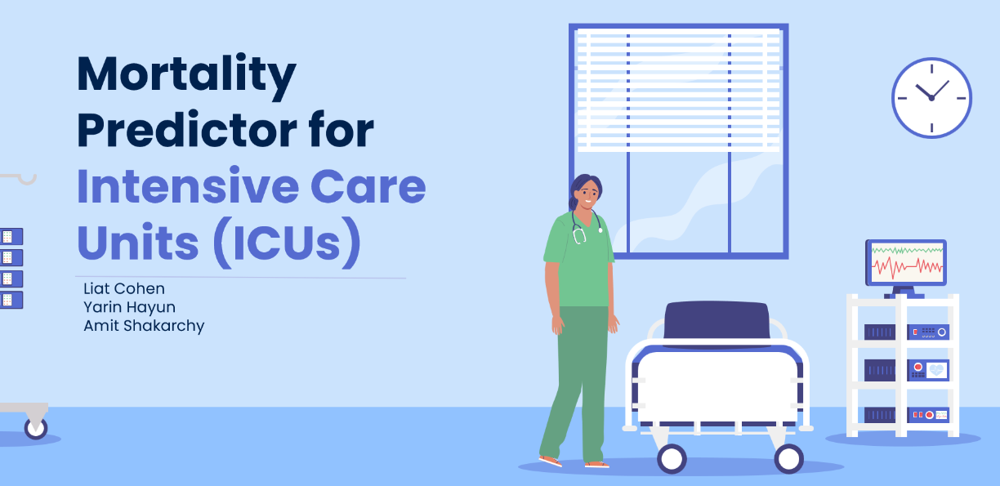
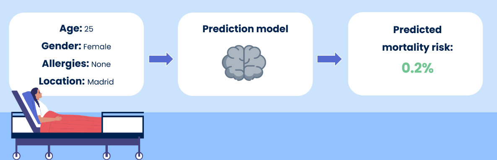
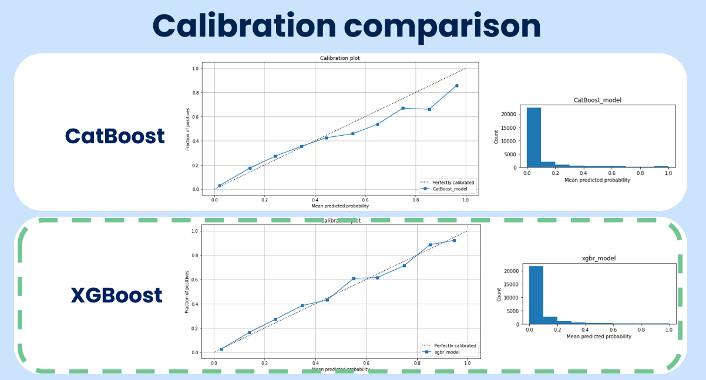

# Mortality-Predictor-for-Intensive-Care-Units

This repository includes the final project created as part of the Ben-Gurion University of the Negev course "Predictive Modelling in Healthcare"
The purpose of this project is to mimic the “real-life” experience of developing a prediction model for healthcare purposes
The data we used was taken from [this Kaggle challenge](https://www.kaggle.com/c/widsdatathon2020).

Potential uses of ICU mortality predictors:
1. Decide who needs to be admitted to the ICU
2. Assess the extent of the intervention measures that should be used
3. Prepare families towards end-of-life decisions

---
 The project includes:
 - Exploratory data analysis
 - exploration of 2 modeling alternative (XGBoost & CatBoost)
 - exploration of models' explainability
 - exploration of models' uncertainty in prediction

